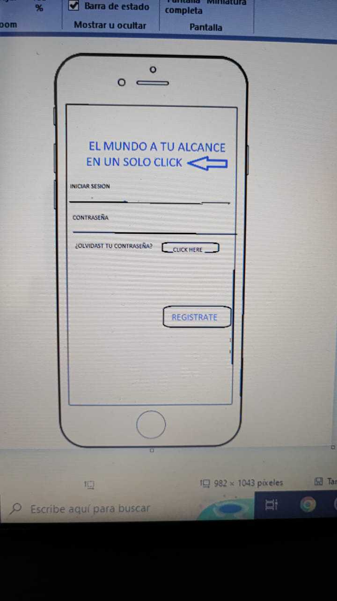
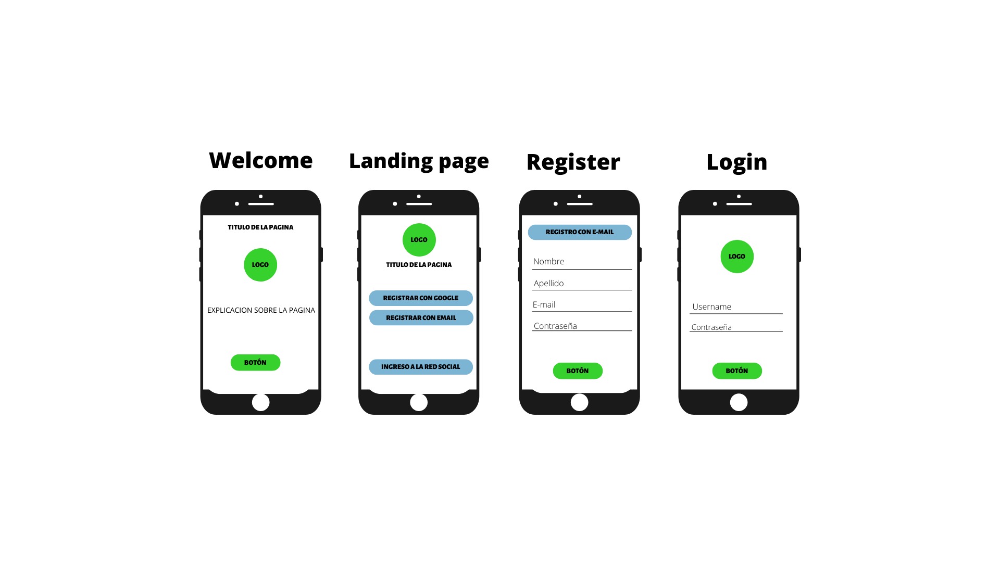
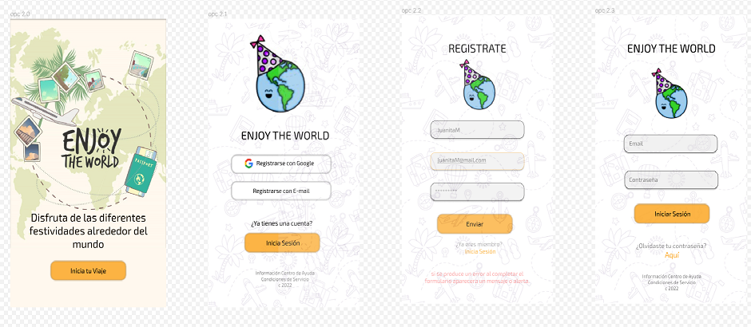

# Enjoy the World

## Índice
* [1. Presentación](#1-presentación)
* [2. Resumen del proyecto](#2-resumen-del-proyecto)
* [3. Objetivos de aprendizaje](#3-objetivos-de-aprendizaje)
* [4. Historias de usuario](#4-historias-de-usuario)
* [5. Criterios de aceptación mínimos del proyecto](#5-criterios-de-aceptación-mínimos-del-proyecto)
* [6. Prototipos](#6-prototipos)
* [7. Pruebas de usabilidad](#7-pruebas-de-usabilidad)
* [8. Trabajo en equipo](#8-trabajo-en-equipo)

## 1. Presentación

En la actualidad nuestro entorno se desenvuelve entre corrientes de internet y redes sociales, hoy en día la humanidad tiene la necesidad de comunicar todo tipo de situaciones que se generan al rededor de su entorno, es por esta razón que nace "Enjoy The world" una red social que quiere ayudar a  miles de usuarios alrededor del mundo a dar a conocer las diferentes fiestas que se celebran en sus ciudades que no tienen un impacto global y que se dan en distintas epocas del año, consideramos que esas pequeñas celebraciones son patrimonio de la humanidad y por consiguiente todos deberiamos saber de su existencia o por lo menos tener un lugar que nos brinde información detallada de cada una de estas. Es también la excusa para mostrar nuestro pequeño lugar en el mundo y fomentar las visitas de locales y extranjeros que se antojan de conocer en persona nuestras festividades.

***

## 2. Resumen del proyecto

El objetivo pricipal de realizar este trabajo, es poner a disposición de los usuarios una red social que le permita públicar las diferentes festividades que se realizan en sus ciudades, pueblos y regiones.

Para la construcción de la página web 'ENJOY THE WORLD' se realizÓ una planeación inicial con el objetivo de organizar la ejecución del proyecto por fases, que incluyeron todo lo relacionado al diseño y la funcionalidad y en general todos los aspectos visuales y de iteración entre el usuario y la aplicación.

Utilizando herramientas como la plataforma [Figma](https://www.figma.com/files/recent?fuid=1138462752466790145), que nos brindó la facilidad de realizar diseños que pudieran adaptarse a las característica de una página web responsive a partir de dos tamaños básicos (mobil y desktop), logramos hacer un prototipo de alta fidelidad llamativo y amigable para cualquier tipo de usuario, implemetando el HTML semantico.

Una vez terminados los prototipos se comenzó a escribir el código base en: HTML, JS por medio de nodos, logrando independizar las vistas y dar la navegación entre las vistas por medio de un ruteo. Adicionalmente contamos con la conexión a una base de datos externa con [firebase](https://firebase.google.com/docs/auth/web/password-auth?hl=es&authuser=0). A partir del resultado de las pruebas de usabilidad realizadas a los usuarios en diferentes etapas de la construcción se realizaron iteraciones a la propuesta inicial, hasta conseguir el resultado actual de la página.

***

## 3. Objetivos de aprendizaje

Marcamos los objetivos que hemos alcanzado como equipo

### HTML

- [x] **Uso de HTML semántico**

### CSS

- [x] **Uso de selectores de CSS**

- [x] **Modelo de caja (box model): borde, margen, padding**

- [x] **Uso de flexbox en CSS**

### Web APIs

- [x] **Uso de selectores del DOM**

- [x] **Manejo de eventos del DOM (listeners, propagación, delegación)**

- [x] **Manipulación dinámica del DOM**

- [x] **Ruteado (History API, evento hashchange, window.location)**

### JavaScript

- [x] **Arrays (arreglos)**

- [ ] **Objetos (key, value)**

- [x] **Diferenciar entre tipos de datos primitivos y no primitivos**

- [x] **Variables (declaración, asignación, ámbito)**

- [x] **Uso de condicionales (if-else, switch, operador ternario, lógica booleana)**

- [ ] **Uso de bucles/ciclos (while, for, for..of)**

- [x] **Funciones (params, args, return)**

- [x] **Pruebas unitarias (unit tests)**

- [x] **Uso de mocks y espías**

- [x] **Módulos de ECMAScript (ES Modules)**

- [x] **Uso de linter (ESLINT)**

- [x] **Uso de identificadores descriptivos (Nomenclatura y Semántica)**

- [x] **Diferenciar entre expresiones (expressions) y sentencias (statements)**

- [x] **Callbacks**

- [x] **Promesas**

### Control de Versiones (Git y GitHub)

- [x] **Git: Instalación y configuración**

- [x] **Git: Control de versiones con git (init, clone, add, commit, status, push, pull, remote)**

- [x] **Git: Integración de cambios entre ramas (branch, checkout, fetch, merge, reset, rebase, tag)**

- [x] **GitHub: Creación de cuenta y repos, configuración de llaves SSH**

- [x] **GitHub: Despliegue con GitHub Pages**

- [x] **GitHub: Colaboración en Github (branches | forks | pull requests | code review | tags)**

- [ ] **GitHub: Organización en Github (projects | issues | labels | milestones | releases)**

### user-centricity

- [x] **Diseñar un producto o servicio poniendo a la usuaria en el centro**

### product-design

- [x] **Crear prototipos de alta fidelidad que incluyan interacciones**

- [x] [**Seguir los principios básicos de diseño visual**]

### research

- [x] **Planear y ejecutar testeos de usabilidad de prototipos en distintos niveles de fidelidad**

### Firebase

- [x] **Firebase Auth**

- [x] **Firestore**

***

## 4. Historias de usuario
**Historia de usuario 1** 

"YO COMO USUARIO de la RED SOCIAL (Enjoy the World) QUIERO una página de bienvenida PARA QUE me invite a suscribirme"

### Criterios de aceptación

* *Que la landing page tenga el formulario de registro**
* *Que aparezca el nombre de la red social**
* *Que sea atractiva y cumple con un diseño visual**
* *Que permita registrarse con Google o con su correo electronico**
* *Solamente se permite el acceso a usuarios con cuentas válidas**
* *No pueden haber usuarios repetidos**
* *La cuenta de usuario debe ser un correo electrónico válido**
* *Lo que se escriba en el campo (input) de contraseña debe ser secreto**
* *Al enviarse el formulario de registro o inicio de sesión, debe validarse**
* *Si hay errores, se deben mostrar mensajes descriptivos para ayudar al usuario a corregirlos** 

***

**Historia de usuario 2**

"YO COMO Usuario de la Red Social (Enjoy The World) QUIERO poder registrarme con mi email PARA poder ingresar y hacer uso de la app."

 ### Criterios de aceptación
- La app cuenta con un formulario que le permite la captura del email y la contraseña del usuario.
- Si los datos ingresados no cumplen con las características solicitadas se generará un mensaje o alerta informándolo y le permitirá la usuario volver a intentarlo.
- Si los datos son correctos, se genera una alerta o mensaje de confirmación del registro.
- Al cerrar el mensaje de confirmación, el usuario ingresará automáticamente a su muro.

***
**Historia de usuario 3**

"YO COMO Usuario de la Red Social (Enjoy The World) QUIERO poder registrarme con Google PARA poder ingresar y hacer uso de la app."

 ### Criterios de aceptación
- Que al hacer click en el  botón dirija al usuario a la ventana de registro de Google
- Que ese mismo botón sirva para ingresar a la aplicación.
- Cuando el usuario ingrese sea redirigido a el muro de Enjoy de world.

***
**Historia de usuario 4**

"YO COMO Usuario de la Red Social (Enjoy The World) QUIERO un muro que me permita postear contenidos PARA recibir likes de otras personas de la Red Social"

### Criterios de aceptación
- El muro tiene un espacio de texto donde se puede escribir un post.
- El espacio de texto cuenta con un botón para publicar el post.
- El botón captura el valor del post y lo procesa con Firebase.
- El muro pinta el post escrito por el usuario.
***
**Historia de usuario 5**

"YO COMO Usuario de la Red Social (Enjoy The World) QUIERO poder editar los post PARA realizar correcciones cuando me equivoco.

### Criterios de aceptación
- En el espacio alrededor del post hay un botón que me permite editar lo que escribí cuando quiera modificarlo.
- La función del botón va a poder identificarse fácilmente.
- La modificación que realice va a visualizarse de inmediato en el post.
***
**Historia de usuario 6**

"YO COMO Usuario de la Red Social (Enjoy The World) QUIERO poder eliminar algún post PARA cuando ya no lo quiera en el muro.

### Criterios de aceptación
- En el espacio alrededor del post hay un botón que me permite eliminar lo que escribí cuando ya no lo quiera en el muro.
- La función del botón va a poder identificarse fácilmente.
- La eliminación que realice va a visualizarse de inmediato en el post.
***
**Historia de usuario 7**

"YO COMO Usuario de la Red Social (Enjoy The World) QUIERO poder dar y recibir likes en los posts PARA demostrar cuánto ha gustado una publicación.

### Criterios de aceptación
- En el espacio alrededor del post hay un botón que permite dar like a lo que un usuario haya escrito en su muro.
- La función del botón va a poder identificarse fácilmente.
- El botón tendrá un contador de likes que evidencie cuántos usuarios han hecho click en él.
-  El botón va a cambiar de color o apariencia dependiendo de si se le da like o si se le quita el like.

***
### Definición de terminado:

  - Debe ser una SPA.
  - Debe ser _responsive_.
  - Deben haber recibido _code review_ de al menos una compañera de otro equipo.
  - Hicieron los _test_ unitarios
  - Testearon manualmente buscando errores e imperfecciones simples.
  - Hicieron _pruebas_ de usabilidad e incorporaron el _feedback_ de los
    usuarios como mejoras.
  - Desplegaron su aplicación y etiquetaron la versión (git tag).

***

## 5. Criterios de aceptación mínimos del proyecto

### 5.1 Creación del Boilerplate
- [x] **Boilerplate**

### 5.2 Definición de la Red Social
- [x] **Definición del producto**

[lluiva de ideas](src/img/Definicion_de_producto.png)

### 5.3 Definición de las historias de usuario
- [x] **Historias de usuario**

### 5.4 Realización de prototipos
- [x] **Diseño de la Interfaz de Usuario**

### 5.5 Mobile first, aplicación responsive
- [x] **Responsive**

### 5.6 Consideraciones del comportamiento de la interfaz de usuario (UI)

- [x] **Creación de cuenta de usuario e inicio de sesión**

- [x] **Muro/timeline**

### 5.7 Consideraciones técnicas Front-end

- [x] **Pruebas unitarias (unit tests)**

### 5.8 Usuario en el centro del diseño
- [x] **Consideraciones técnicas UX**

***

## 6. Prototipos
Se diseñaron e iteraron unos prototipos iniciales para conceptualizar desde las diferentes estrategias de 'mobil first' cómo quedaría la aplicación:

Posteriormente plasmamos los prototipos de alta fidelidad a partir de los cuales realizamos las pruebas de usabilidad.

***

## 7. Pruebas de usabilidad
se adjuntan las evidencias de las pruebas de usabilidad realizadas

***

## 8. Trabajo en equipo
Durante el proyecto conseguimos comprender cómo se articulan las diferentes integrantes de un equipo para conseguir los resultados esperados. Juntas aprendimos a planear alrededor de nuestro tiempo disponible y las herramientas que cada una tenía a disposición, producto de las experiencias pasadas y del aprendizaje personal. Nos vimos enfrentadas a diversos retos técnicos y personales que supimos afrontar, en ocasiones con apoyo de Laboratoria, pero en general con nustros propios recursos internos. Descubrimos muchas cosas sobre nosotras mismas, sobre nuestros límites, sobre nuestro manejo de la frustración, pero sobre todo de nuestro temple, la comunicación asertiva, y nuestros inmensos deseos de aprender juntas a ser mejores desarrolladoras y mejores personas.

***